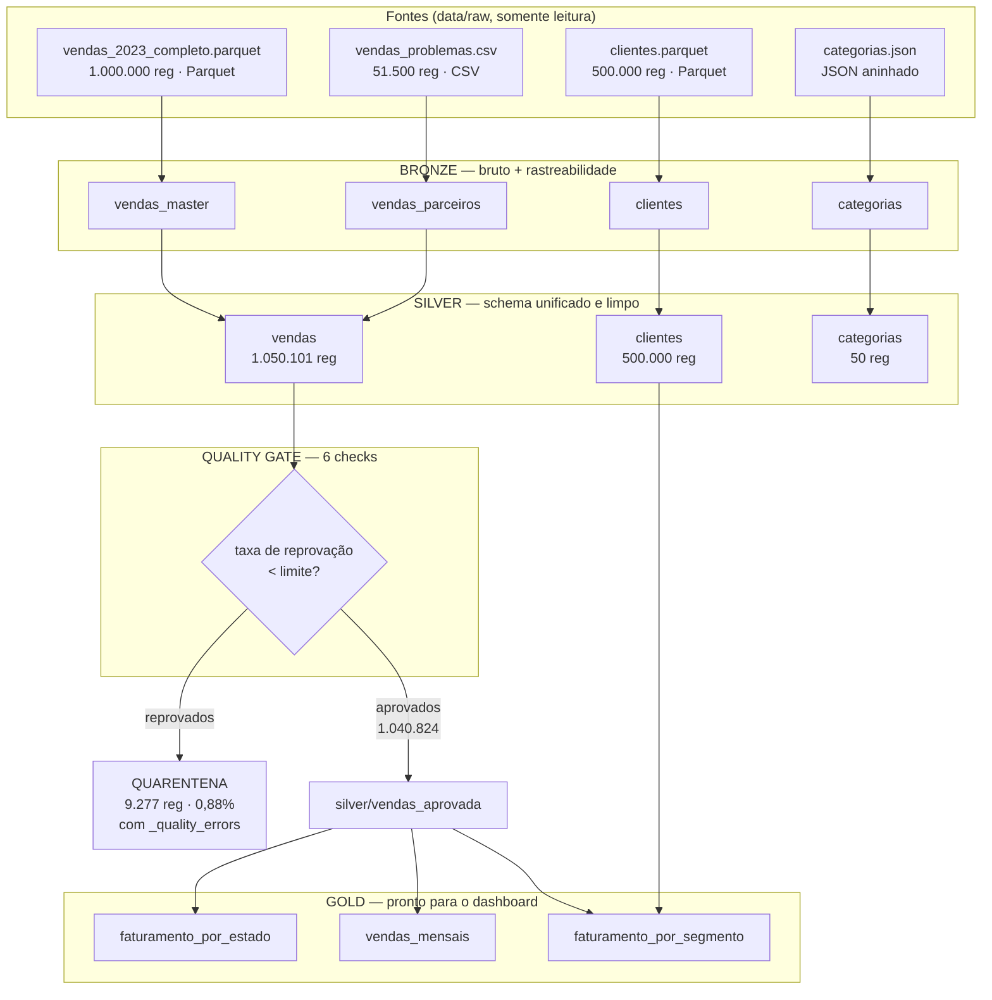
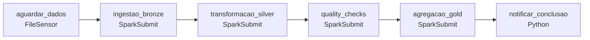

# Arquitetura do Pipeline

## Visão geral

## Orquestração

DAG `pipeline_medallion_shopbrasil`, disparo manual (`schedule=None`), pois a
entrega é uma demonstração ao vivo. Uma falha em `quality_checks` interrompe o
fluxo antes da Gold.

## Responsabilidade de cada camada

### Bronze — fidelidade

Lê e grava sem nenhuma transformação de negócio. Acrescenta apenas metadados de
rastreabilidade: `_source`, `_source_format`, `_source_file`, `_ingestion_ts` e
`_ingestion_date`.

O CSV é lido com `inferSchema=False`: tudo entra como texto. É proposital —
inferir tipos aqui descartaria silenciosamente os registros malformados que
precisamos levar até a quarentena.

### Silver — normalização

É onde as duas fontes de vendas convergem. O Parquet chega tipado, o CSV chega
100% string; ambos são forçados ao mesmo schema canônico:

| Coluna | Parquet | CSV | Silver |
|---|---|---|---|
| `quantity` | int | string | int |
| `unit_price` | double | string | double |
| `total_amount` | double | string | double |
| `order_date` | timestamp | string | date |

Os casts são permissivos de propósito: `"abc"` em `quantity` vira `NULL` em vez
de derrubar o job, e o check de completude captura o registro. Quebrar na leitura
esconderia o problema; converter para nulo o torna auditável.

Além dos tipos: trim em todo texto, valores como `""`, `"NULL"` e `"N/A"`
convertidos em nulo real, UF em maiúscula, status e forma de pagamento em
minúscula, cidade em initcap. O `total_amount` é recalculado quando está nulo mas
`quantity` e `unit_price` existem — a coluna `_total_recalculado` marca esses
casos.

A deduplicação remove linhas integralmente idênticas nas colunas de negócio.
Divergências de `order_id` com conteúdo diferente **não** são removidas aqui:
viram falha no check de unicidade, para ficarem visíveis.

O `categorias.json` é a única fonte com transformação estrutural: chega como uma
linha contendo um array de 10 categorias, cada uma com um array de 5
subcategorias. Dois `explode` encadeados achatam isso em 50 linhas.

### Quality Gate — separação

Roda **depois** da Silver, não dentro dela. A Silver normaliza; ela não julga.
Essa separação é o que torna a quarentena auditável: o registro reprovado existe
em `silver/vendas` normalizado **e** em `data/quarantine/` com o motivo.

Um registro pode violar várias regras — a coluna `_quality_errors` é um array com
todos os nomes de check violados.

### Gold — negócio

Lê exclusivamente `silver/vendas_aprovada`. Nenhum dado em quarentena entra em
métrica. Filtra ainda por status faturável (`confirmed`, `shipped`, `delivered`):
pedido cancelado ou devolvido não é receita.

---

## Decisões de projeto

### Spark em `local[*]` dentro do container do Airflow

Não há cluster Spark standalone separado. Para o volume do projeto (1,05 milhão
de registros), o overhead de rede entre driver e executors não se paga, e a
decisão elimina um ponto de falha na demonstração ao vivo. A integração
Airflow + Spark continua explícita, via `SparkSubmitOperator` e conexão
`spark_local`.

### Imagem customizada do Airflow

A imagem oficial do Airflow não traz Java nem Spark, então qualquer
`spark-submit` disparado por uma task falharia. O `Dockerfile.airflow` acrescenta
OpenJDK 17, PySpark 3.5.1 e o provider `apache-airflow-providers-apache-spark`.

### Conexões declaradas por variável de ambiente

`spark_local` e `fs_default` são definidas via `AIRFLOW_CONN_*` no compose, não
criadas pela interface. Conexão criada na interface vive no banco de metadados e
funcionaria só na máquina de quem criou — quebraria em qualquer clone novo. Essa
escolha é o que sustenta a promessa do `docker compose up` sem intervenção.

### Camadas geradas em volume nomeado

`data/raw` é bind mount somente leitura (é a entrada que o usuário fornece);
Bronze, Silver, Gold, quarentena e relatórios vivem no volume `lake-data`.

Camada intermediária de pipeline é dado efêmero e recriável: não precisa estar no
host, e mantê-la fora dele torna o ambiente idêntico em qualquer máquina. Como
efeito colateral, isso também eliminou uma classe de falhas de escrita observadas
sobre o sistema de arquivos compartilhado do Windows.

### Serviço `data-init`

Um volume Docker nasce pertencendo ao `root`, e o Airflow roda como uid 50000.
O serviço `data-init` sobe antes de tudo, como root, cria as pastas das camadas e
transfere a posse. Sem ele o Spark não consegue escrever.

### Escrita particionada em todas as camadas

Todas as escritas usam `.mode("overwrite").partitionBy(...)` com
`spark.sql.sources.partitionOverwriteMode=dynamic` — o mesmo padrão do material
da Aula 7.

| Saída | Chave de partição |
|---|---|
| `bronze/*` | `_ingestion_date` |
| `silver/vendas`, `silver/vendas_aprovada` | `ano_mes` |
| `silver/clientes` | `state` |
| `silver/categorias` | `category_id` |
| `quarantine/vendas_reprovada` | `_source` |
| `gold/*` | `data_processamento` |

Além de tornar a escrita idempotente e permitir reprocessar uma partição isolada,
essa decisão resolveu um problema concreto de infraestrutura: com `overwrite` sem
partição, o Spark apaga o diretório de saída inteiro antes de escrever e depois
cria o `_temporary` dentro dele. Sobre o sistema de arquivos do ambiente, a
remoção chegava atrasada e levava junto o `_temporary` recém-criado — as tasks
gravavam e os arquivos desapareciam, de forma intermitente. Com overwrite
dinâmico o diretório não é apagado: apenas as partições presentes nos dados são
substituídas, e a corrida deixa de existir.

---

## Limitação conhecida

`categorias` é ingerida, achatada e disponibilizada na Silver, mas **não alimenta
nenhuma tabela Gold**. Não existe chave ligando `product_id` das vendas
(`PROD_xxxx`) a `category_id` do JSON (`CAT_xx`).

Ela cumpre o requisito de ingestão multi-formato e fica modelada como dimensão de
referência, pronta para uso quando uma fonte de produtos com esse mapeamento for
integrada — `datasets/aula_01/produtos.csv` é a candidata natural.

## Observação sobre os dados

A série temporal cresce de janeiro (R$ 228 mi) até setembro (R$ 3,41 bi) e cai
até dezembro (R$ 494 mi, −67% MoM). Esse comportamento é característica do
dataset sintético, não sazonalidade de e-commerce — em dados reais, novembro e
dezembro seriam o pico por causa da Black Friday. Em produção, essa distribuição
atípica seria sinalizada ao time de ingestão.
